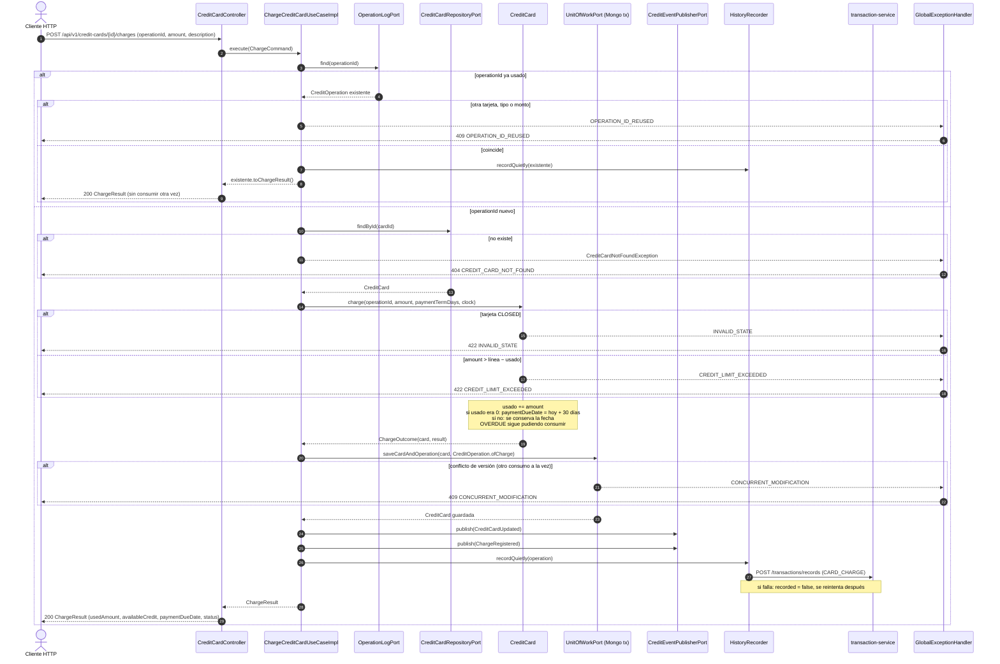

# Secuencia — Consumo de tarjeta con control de línea (`POST /credit-cards/{id}/charges`)

Implementado en `ChargeCreditCardUseCaseImpl` (R3), `CreditCard.charge` (R2),
`MongoUnitOfWorkAdapter` (R4), `MovementRecorderRestAdapter` (R7) y `CreditCardController` (R5).

## Notas

- **El control de línea es del agregado.** `CreditCard.charge` compara contra `availableCredit()`
  (`creditLimit − usedAmount`); el constructor del `record` además impide que `usedAmount` supere la
  línea, así que no hay forma de construir una tarjeta sobregirada.
- **Dos consumos simultáneos** sobre la misma tarjeta leen la misma `version`; el segundo en guardar
  falla con bloqueo optimista → 409 `CONCURRENT_MODIFICATION`. Así no se puede pasar la línea por
  carrera: el cliente reintenta con el mismo `operationId` y se evalúa contra el saldo nuevo.
- **Un rechazo no deja registro** (solo se guardan operaciones aplicadas), así que repetir un consumo
  rechazado vuelve a evaluarse; útil si mientras tanto se pagó o se subió la línea.
- **Fecha de pago.** Se fija solo en el primer consumo con usado 0 (`credit.card.payment-term-days`,
  30 por defecto) y se borra cuando un pago deja usado 0. Es la fecha que mira la revisión de vencidos.
- **Saldo.** `GET /credit-cards/{id}/balance` devuelve línea, usado, disponible y fecha de pago
  (`CardBalanceView`).
