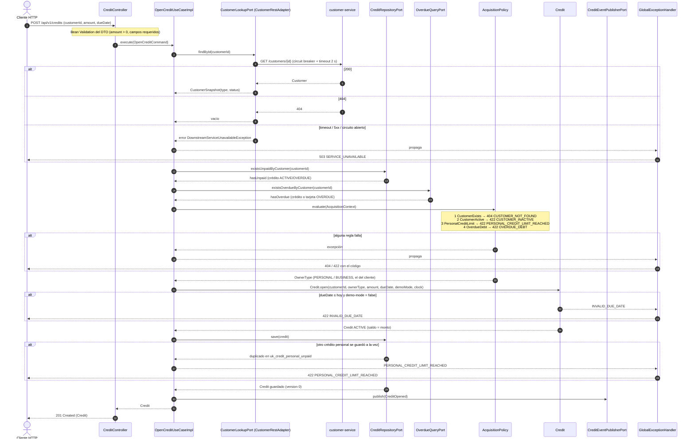

# Secuencia — Otorgar crédito (`POST /credits`)

Implementado en `OpenCreditUseCaseImpl` (R3), `AcquisitionPolicy` y sus validadores (R2),
`CustomerRestAdapter` (R7), `CreditPersistenceAdapter` / `OverdueQueryAdapter` (R4) y
`CreditController` / `GlobalExceptionHandler` (R5). La emisión de tarjeta (`POST /credit-cards`) usa la
misma cadena con `ProductType.CREDIT_CARD` (el tope de crédito personal no aplica) y reintenta hasta 3
veces si el número generado choca con `uk_card_number`.

## Notas

- **Los datos se reúnen antes de decidir.** El caso de uso hace las tres consultas (cliente, crédito
  no pagado, deuda vencida) y le pasa todo a `AcquisitionPolicy`, que es pura: no conoce puertos ni
  Reactor. Por eso se prueba sin mocks (`AcquisitionPolicyTest`).
- **Cliente inexistente = vacío, no error.** `CustomerRestAdapter` traduce el 404 a vacío y es el
  eslabón 1 de la cadena el que lo convierte en 404 `CUSTOMER_NOT_FOUND`; cualquier otra falla de
  `customer-service` es 503.
- **La carrera de la regla 3** (dos `POST /credits` simultáneos del mismo cliente personal) la cubre
  el índice único parcial `uk_credit_personal_unpaid` sobre `unpaidPersonal: true`;
  `PersistenceErrors` traduce el duplicado al mismo 422 que daría la validación.
- **Modo demo.** Con `credit.demo-mode: true` (Config Server) se acepta una fecha pasada, para poder
  probar la revisión de vencidos desde Postman sin esperar.
- **El evento sale por `NoOpCreditEventPublisher`** hasta que exista el broker (P3); solo deja log.
