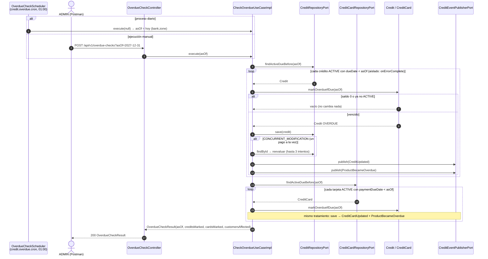
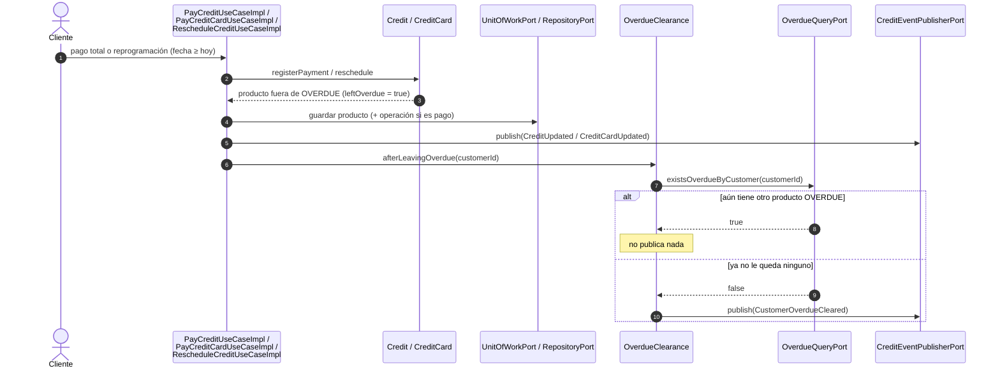

# Secuencia — Revisión de deuda vencida (`detected` y `cleared`)

Implementado en `CheckOverdueUseCaseImpl` y `OverdueClearance` (R3), `markOverdueIfDue` de `Credit` y
`CreditCard` (R2), `OverdueCheckScheduler` / `OverdueCheckController` (R5–R6) y
`OverdueQueryAdapter` (R4). Flujo de negocio completo en `bank-docs/flows/04-overdue-debt.md`.

## Detección (`credit.overdue.detected`)

## Limpieza (`credit.overdue.cleared`)

## Notas

- **Idempotente.** Solo se leen productos `ACTIVE` con fecha vencida, y `markOverdueIfDue` devuelve
  vacío si no aplica; repetir la revisión con el mismo `asOf` no cambia ni publica nada.
- **Aislamiento por producto.** Un error en uno (`onErrorComplete`) no detiene a los demás; queda para
  la siguiente corrida. Un conflicto de versión (un pago que llegó a la vez) se resuelve recargando y
  reevaluando, hasta `MAX_ATTEMPTS = 3`: si el pago dejó saldo 0, ya no se marca.
- **Fuente de verdad.** Este servicio es el dueño de la deuda vencida: `OverdueDebtValidator` la
  consulta (`OverdueQueryAdapter`, créditos y tarjetas `OVERDUE`) antes de otorgar un producto, y
  `account-service` la consultará al abrir cuentas en P2.
- **`detected` por producto, `cleared` por cliente.** Se publica un `ProductBecameOverdue` por cada
  producto marcado, pero `CustomerOverdueCleared` solo una vez, cuando sale el último.
- **`asOf` manual y modo demo.** `POST /overdue-checks?asOf=...` permite simular otro día desde
  Postman; con `credit.demo-mode` se crean productos con vencimiento pasado para disparar la detección.
- **Varias instancias.** Hoy el cron corre en cada instancia; sigue pendiente un bloqueo distribuido
  (ficha §12).
