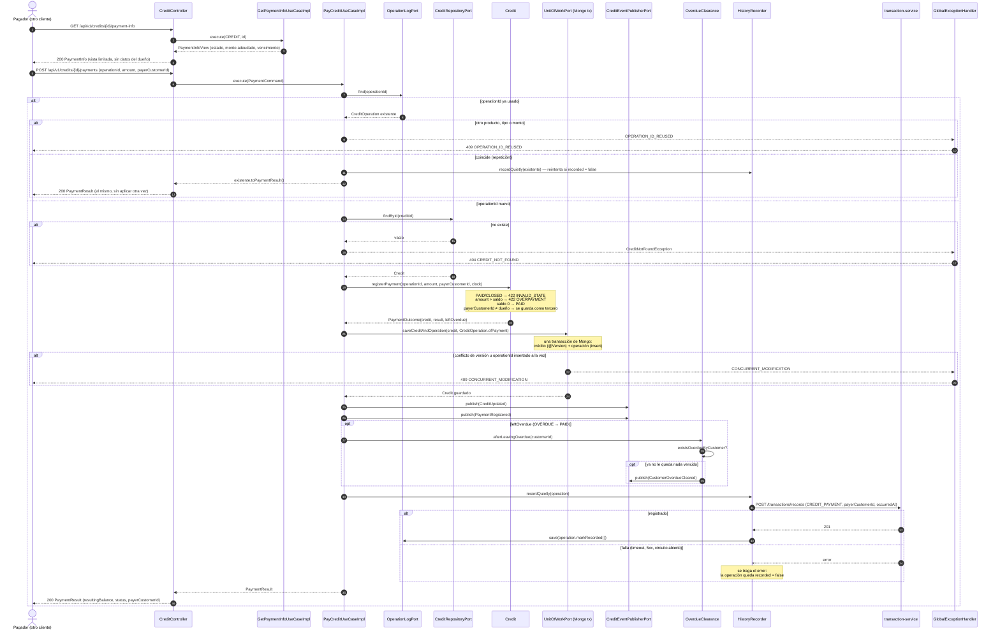

# Secuencia — Pago de crédito de un tercero (`POST /credits/{id}/payments`)

Implementado en `GetPaymentInfoUseCaseImpl` y `PayCreditUseCaseImpl` (R3), `HistoryRecorder` y
`OverdueClearance` (R3), `MongoUnitOfWorkAdapter` / `OperationLogPersistenceAdapter` (R4),
`MovementRecorderRestAdapter` (R7) y `CreditController` (R5). El pago de tarjeta
(`POST /credit-cards/{id}/payments`) sigue el mismo flujo con `CreditCard.registerPayment`.

## Notas

- **Idempotencia por `operationId`.** `credit_operations` tiene índice único por `operationId`; solo
  se guardan operaciones aplicadas, así que un pago rechazado (422) no deja registro y repetirlo se
  evalúa de nuevo. Una repetición idéntica devuelve el resultado guardado sin tocar el saldo.
- **Producto y operación se guardan juntos** (`MongoUnitOfWorkAdapter`, `TransactionalOperator`):
  nunca queda un saldo descontado sin su operación ni al revés. Necesita el replica set `rs0`.
- **El historial no cambia la respuesta.** El pago ya ocurrió cuando se llama a `transaction-service`;
  si esa llamada falla la respuesta sigue siendo 200 y la operación queda `recorded = false`. La
  retoman `RecordRecoveryScheduler` (cada minuto, operaciones con más de
  `credit.recorder.pending-minutes`), `POST /credit-recovery-runs` o la repetición del mismo
  `operationId`. `transaction-service` es idempotente por `operationId`, así que registrar dos veces
  es seguro.
- **Tercero.** `payerCustomerId` solo se guarda en el resultado si es distinto del dueño; el pago no
  debita ninguna cuenta (ficha §12). La vista `payment-info` es lo único que el tercero ve del
  producto.
- **Limpieza de deuda vencida.** `CustomerOverdueCleared` se publica una sola vez por cliente: solo
  cuando el producto pagado era el último `OVERDUE` que le quedaba (ver `overdue-check.md`).
