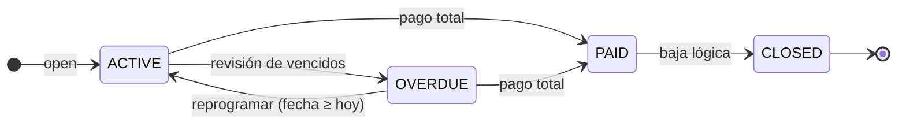
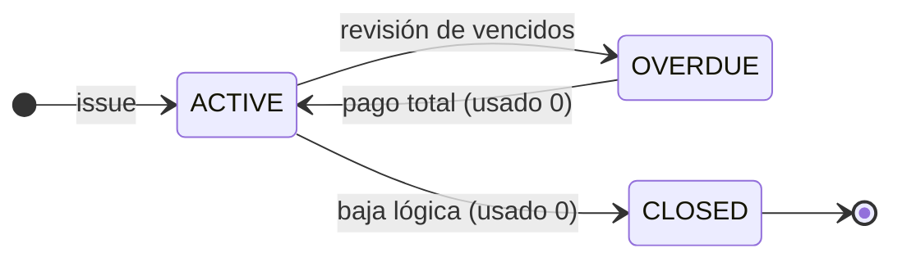

# UML — Dominio de credit-service

Paquete `com.bank.credit.domain` (R2). Los agregados son `record` inmutables: cada operación
devuelve una instancia nueva, y `version` la mantiene el adaptador de Mongo (bloqueo optimista →
`CONCURRENT_MODIFICATION`, 409). En el diagrama se omite el `Clock` que reciben los métodos y se
abrevian los parámetros.

## Modelo de dominio

```mermaid
classDiagram
    direction TB

    class Credit {
        <<aggregate>>
        +CreditId id
        +String customerId
        +OwnerType ownerType
        +Money principalAmount
        +Money outstandingBalance
        +LocalDate dueDate
        +CreditStatus status
        +long version
        +open(customer, owner, amount, due, demo)$ Credit
        +registerPayment(op, amount, payer) PaymentOutcome
        +markOverdueIfDue(asOf) Optional~Credit~
        +reschedule(newDue, demo) Credit
        +close() Credit
        +isUnpaid() boolean
    }

    class CreditCard {
        <<aggregate>>
        +CreditCardId id
        +String customerId
        +OwnerType ownerType
        +CardNumber cardNumber
        +Money creditLimit
        +Money usedAmount
        +LocalDate paymentDueDate
        +CardStatus status
        +long version
        +issue(customer, owner, number, limit)$ CreditCard
        +availableCredit() Money
        +charge(op, amount, termDays) ChargeOutcome
        +registerPayment(op, amount, payer) PaymentOutcome
        +markOverdueIfDue(asOf) Optional~CreditCard~
        +changeLimit(newLimit) CreditCard
        +close() CreditCard
    }

    class CreditOperation {
        <<entity>>
        +OperationId operationId
        +OperationType type
        +ProductType productType
        +String productId
        +String customerId
        +String payerCustomerId
        +Money amount
        +Money resultingBalance
        +Money availableCredit
        +boolean recorded
        +Instant occurredAt
        +ofPayment(result, customer)$ CreditOperation
        +ofCharge(result, customer, desc)$ CreditOperation
        +matches(productId, type, amount) boolean
        +markRecorded() CreditOperation
        +toPaymentResult() PaymentResult
        +toChargeResult() ChargeResult
    }

    class Money {
        <<value object>>
        +BigDecimal amount
        +String currency = PEN
        +plus(Money) Money
        +minus(Money) Money
        +isGreaterThan(Money) boolean
        +isZero() boolean
    }
    class CardNumber {
        <<value object>>
        +String value (16 dígitos)
        +masked() String
    }
    class OperationId {
        <<value object>>
        +String value
    }
    class CreditId {
        <<value object>>
    }
    class CreditCardId {
        <<value object>>
    }
    class CustomerSnapshot {
        <<value object>>
        +String customerId
        +CustomerType type
        +String status
        +isActive() boolean
    }
    class PaymentResult {
        <<value object>>
        +OperationId operationId
        +ProductType productType
        +String productId
        +Money amount
        +Money resultingBalance
        +String status
        +String payerCustomerId
    }
    class ChargeResult {
        <<value object>>
        +OperationId operationId
        +String cardId
        +Money amount
        +Money usedAmount
        +Money availableCredit
        +LocalDate paymentDueDate
        +CardStatus status
    }

    class AcquisitionPolicy {
        <<domain service>>
        +evaluate(AcquisitionContext) OwnerType
    }
    class AcquisitionValidator {
        <<interface>>
        +validate(AcquisitionContext)
    }
    class CardNumberGenerator {
        <<domain service>>
        +generate(random) CardNumber
    }

    class CreditStatus {
        <<enumeration>>
        ACTIVE
        OVERDUE
        PAID
        CLOSED
    }
    class CardStatus {
        <<enumeration>>
        ACTIVE
        OVERDUE
        CLOSED
    }
    class OwnerType {
        <<enumeration>>
        PERSONAL
        BUSINESS
        +of(CustomerType)$ OwnerType
    }

    Credit *-- CreditId
    Credit *-- Money
    Credit --> CreditStatus
    Credit --> OwnerType
    CreditCard *-- CreditCardId
    CreditCard *-- CardNumber
    CreditCard *-- Money
    CreditCard --> CardStatus
    CreditCard --> OwnerType
    Credit ..> PaymentResult : registerPayment
    CreditCard ..> PaymentResult : registerPayment
    CreditCard ..> ChargeResult : charge
    CreditOperation *-- OperationId
    CreditOperation ..> PaymentResult : ofPayment / toPaymentResult
    CreditOperation ..> ChargeResult : ofCharge / toChargeResult
    AcquisitionPolicy o-- "4" AcquisitionValidator : cadena
    AcquisitionPolicy ..> CustomerSnapshot : lee
    CardNumberGenerator ..> CardNumber : crea
```

Validadores de la cadena (`domain/service/validation`), en orden; el primero que falla corta:

| # | Validador | Error |
|---|-----------|-------|
| 1 | `CustomerExistsValidator` | 404 `CUSTOMER_NOT_FOUND` |
| 2 | `CustomerActiveValidator` | 422 `CUSTOMER_INACTIVE` |
| 3 | `PersonalCreditLimitValidator` (solo crédito, solo `PERSONAL`) | 422 `PERSONAL_CREDIT_LIMIT_REACHED` |
| 4 | `OverdueDebtValidator` | 422 `OVERDUE_DEBT` |

`AcquisitionPolicy.evaluate` devuelve `OwnerType.of(customer.type())`: el tipo del producto es
siempre el del cliente, así que ese eslabón no puede fallar.

## Estados de `Credit`

## Estados de `CreditCard`

Una tarjeta `OVERDUE` sigue aceptando consumos (decisión de negocio, ficha §12). No existe `PAID` en
tarjetas: con usado 0 vuelve a `ACTIVE` y se borra la fecha de pago.

## Invariantes

| Regla | Dónde se aplica |
|-------|-----------------|
| Monto de crédito y línea de tarjeta > 0 | `Credit.open`, `CreditCard.issue`, `changeLimit` |
| Vencimiento futuro, salvo `credit.demo-mode` | `Credit.open`, `Credit.reschedule` → `INVALID_DUE_DATE` |
| Pago ≤ saldo pendiente / usado | `registerPayment` → `OVERPAYMENT` |
| Pago total: crédito → `PAID`; tarjeta → `ACTIVE` y sin fecha de pago | `registerPayment` |
| Consumo ≤ crédito disponible | `CreditCard.charge` → `CREDIT_LIMIT_EXCEEDED` |
| La fecha de pago de la tarjeta se fija en el primer consumo con usado 0 (+30 días) | `CreditCard.charge` (`credit.card.payment-term-days`) |
| Vencido = fecha pasada y saldo > 0; solo desde `ACTIVE` (idempotente) | `markOverdueIfDue` |
| Nueva línea ≥ usado | `changeLimit` → `LIMIT_BELOW_USED_AMOUNT` |
| Baja lógica solo con saldo/usado 0 | `close` → `NOT_CLOSABLE` |
| Productos `CLOSED` (y créditos `PAID`) no aceptan pagos | `registerPayment` → `INVALID_STATE` |
| Un solo crédito personal no pagado | `PersonalCreditLimitValidator` + índice parcial `uk_credit_personal_unpaid` |
| Número de tarjeta único (16 dígitos, Luhn) | `CardNumberGenerator` + índice `uk_card_number` (3 intentos) |
| El número de tarjeta nunca se imprime completo | `CardNumber.toString()` enmascarado, `@ToString.Exclude` en el documento |
